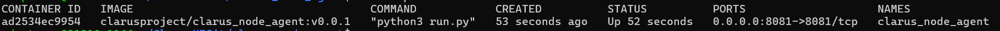
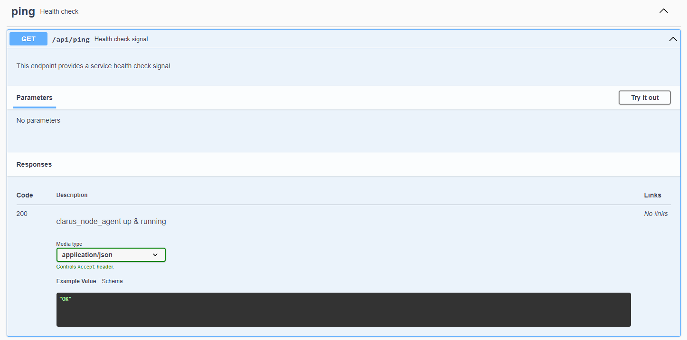
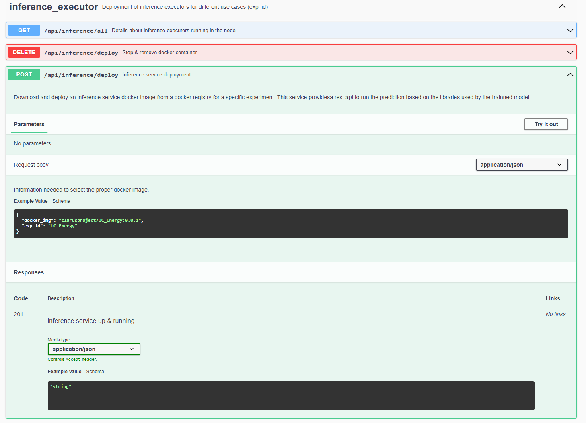
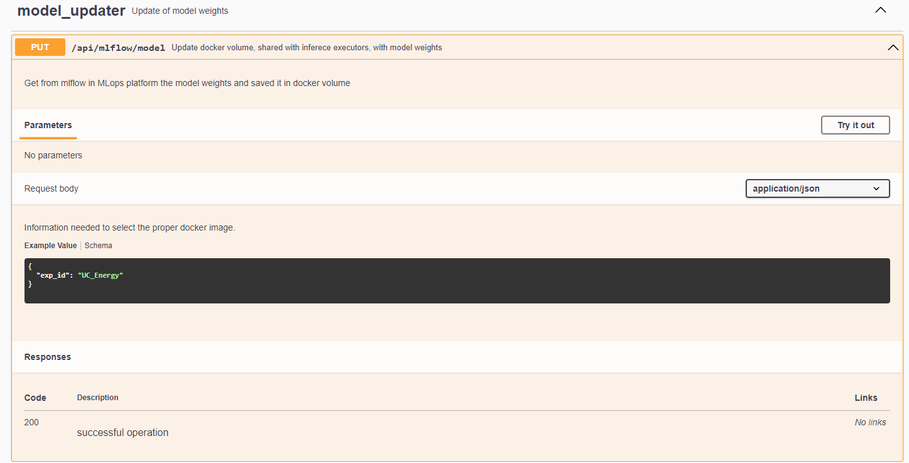

# clarus_node_agent

This repository contains the docker-compose file needed to deploy the clarus_node_agent service at the pilots machines. This service will allow the deployment of inference services as well as the download of the best trainned model for each inference service.


## Requirements
- Linux machine with  8 GB RAM and 70 GB Disk and connection to Internet 
- Ubuntu 22 or higher
- Docker version 23.0.5 or above installed
- Docker-compose version 1.29.2 or above installed
- MLOPs platform Docker registry (deployed at 34.250.205.215:5001) configured as insecure-registry in /etc/docker/daemon.json

## Deployment 
The content needed for the deployment is available in the Clarus github repository https://github.com/CLARUS-Project and the images used are in the Clarus docker hub repository https://hub.docker.com/repositories/clarusproject.
The credentials to pull images from docker hub  are saved in the Polimi repository.

### Clone repository
- Clone clarus_node_agent
    ```
    ./git clone https://github.com/CLARUS-Project/clarus_node_agent
    ``` 

### Add docker registry in Training Platform as an insecure registry
- Move to file /etc/docker/daemon.json (create if it doesn´t exist)
- Add in the "insecure-registries" entry
  
  ```
      "insecure-registries": [
          "34.250.205.215:5001"
      ]
    ```

### Start service
Move to the folder where the repo has been cloned.
- Login in Dockerhub using the clarusproject credentials provided in the project
    ```
    docker login -username=clarusproject
    ```


- Execute docker-compose file in the folder
    ```
    docker-compose up -d
    ```

- Once docker-compose is finished, the service shall be up and running. To check it, write in terminal type in terminal
    ```
    docker ps -a
    ```
You shall see next services up:




## Usage

Once the service is up and running, it provides a REST API that can be used for other processes running in the pilot plant machines. The REST API can be reached with a web browser at http://<IP_where_clarus_node_agent_is_deployed>:8081/swagger

These are the functionalities covered by the REST API.

  

- [x] /api/ping.
  This path is for health check support

  

- [x] /api/inference/deploy (POST).
   This path will pull an inference docker image and  run it as a service in a docker container. The body request need two parameters:
    ```
    "exp_id": Experiment identifier. Inference service is valid for that experiment and will use this identifier as container name.
    "docker_img": Docker registry location where the inference image has been uploaded.
    ```
    

- [x] /api/inference/deploy (DELETE).
This path will stop and remove an inference service container. The path requires the next mandatory parameter.
    ```
    "exp_id": Experiment identifier to remove. Inference service is valid for that experiment and will use this identifier as container name.
    
    ```

- [x] /api/inference/all (GET).
This path will provide information about the inference containers that are running in the host where the node agent is deployed. The information contains Inference ID and port where the execution service is provided.

  

- [x] /api/mlflow/model (PUT).
This path will download the best model for an experiment(stagged as production in mlflow) from the mlflow repository at MLOPs platform. This model will contain the weights needed to execute the inference. This model will be saved in a docker volume shared with all the inference services downloaded. The body request need one parameter:
    ```
    "exp_id": Experiment identifier. Model has been trainned for this experiment.    
    ```


